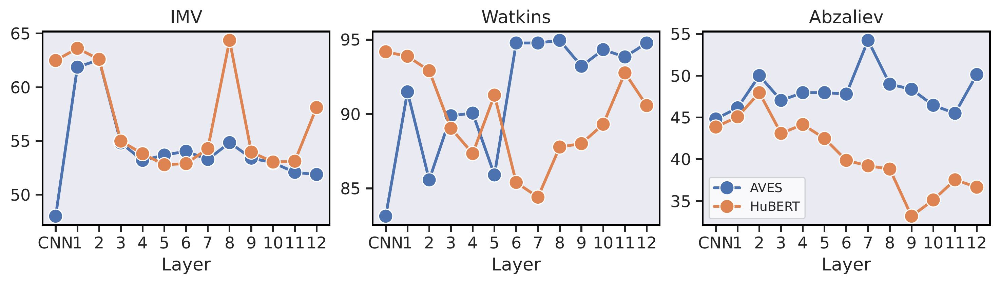

# Comparing Self-Supervised Learning Models Pre-Trained on Human Speech and Animal Vocalizations for Bioacoustics Processing


[[Paper]](https://arxiv.org/abs/2501.05987)

<p align="center">

[](https://github.com/pre-commit/pre-commit)
[](https://pytorch.org/get-started/locally/)
[](https://pytorchlightning.ai/)
[](https://hydra.cc/)
[](https://black.readthedocs.io/en/stable/)
[](https://pycqa.github.io/isort/)
[](https://github.com/idiap/ssl-human-animal/blob/main/LICENSE)
[](tps://github.com/ssl-human-animal/)
<br><br>


</p>

## Cite

This repository contains the source code for the paper _Comparing Self-Supervised Learning Models Pre-Trained on Human Speech and Animal Vocalizations for Bioacoustics Processing_ by **E. Sarkar** and **M. Magimai Doss**, accepted at **IEEE International Conference on Acoustics, Speech, and Signal Processing (ICASSP) 2025**.

Please cite the original authors for their work in any publication(s) that uses this work:

```bib
@INPROCEEDINGS{Sarkar_ICASSP_2025,
         author = {Sarkar, Eklavya and Magimai-Doss, Mathew},
          title = {Comparing Self-Supervised Learning Models Pre-Trained on Human Speech and Animal Vocalizations for Bioacoustics Processing},
      booktitle = {IEEE International Conference on Acoustics, Speech and Signal Processing (ICASSP 2025)},
           year = {2025},
}
```

## Datasets

[InfantMarmosetsVox](https://www.idiap.ch/en/dataset/infantmarmosetsvox/index_html) is a publicly available marmoset dataset for multi-class call-type and caller identification. It also contains a usable Pytorch `Dataset` and `Dataloader`. Any publication (eg. conference paper, journal article, technical report, book chapter, etc) resulting from the usage of InfantsMarmosetVox **must cite** its own release [paper](https://www.isca-speech.org/archive/interspeech_2023/sarkar23_interspeech.html):

```bib
@inproceedings{sarkar23_interspeech,
  title     = {Can Self-Supervised Neural Representations Pre-Trained on Human Speech distinguish Animal Callers?},
  author    = {Eklavya Sarkar and Mathew Magimai.-Doss},
  year      = {2023},
  booktitle = {INTERSPEECH 2023},
  pages     = {1189--1193},
  doi       = {10.21437/Interspeech.2023-1968},
  issn      = {2958-1796},
}
```

The [Watkins](https://whoicf2.whoi.edu/science/B/whalesounds/index.cfm) dataset is publicably available, and the [Mescalina Bark ID Data Base](http://dx.doi.org/10.3233/JIFS-169509) can be obtained upon request to its original authors.

## Installation

This package has very few requirements. 
To create a new conda/mamba environment, install [conda](https://conda.io), then [mamba](https://mamba.readthedocs.io/en/latest/installation.html#existing-conda-install), and simply follow the next steps:

```bash
# Clone project
git clone https://github.com/idiap/ssl-human-animal
cd ssl-human-animal

# Create and activate environment
mamba env create -f environment.yml
mamba activate animal_env
```

## Usage
In order to use this repository, you must correctly configure the paths to your datasets in `configs/paths/default.yaml`. Make sure to only edit in the correct path to all the varaibles listed under `PATHS TO MODIFY`.

Then, the experiments conducted in this paper can be found in the [scripts](scripts) folder. These contain feature extraction and training scripts. 

Sample run:

```bash
$ ./scripts/feature_extraction/wavlm.sh
$ ./scripts/train/wavlm.sh
```

These use [gridtk](https://pypi.org/project/gridtk/) but can be reconfigured according to the user's needs.

One can also train an individual model with chosen experiment configuration from [configs/experiment/](configs/experiment/)

```bash
python src/train.py experiment=experiment_name.yaml
```

You can override any parameter from command line like this

```bash
python src/train.py trainer.max_epochs=20
```

## Directory Structure

The structure of this directory is organized as the following:

```
.
├── CITATION.cff            # Setup
├── configs                 # Experiment configs
├── environment.yaml        # Environment file
├── hydra_plugins           # Plugins
├── img                     # Images
├── LICENSE                 # License
├── Makefile                # Setup
├── MANIFEST.in             # Setup
├── pyproject.toml          # Setup
├── README.md               # This file
├── requirements.txt        # Requirements
├── scripts                 # Scripts
├── setup.py                # Setup
├── src                     # Python source code
└── version.txt             # Version

```

## Contact

For questions or reporting issues to this software package, kindly contact the first [author](mailto:eklavya.sarkar@idiap.ch).